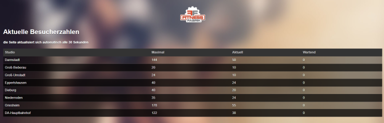

# fitnessfabrik_usage_diagramm

My local gym Fitnessfabrik started offering a [visitor count](http://besucher.fitnessfabrik.de) during the Corona period in 2020. The websites only shows the current visitor count 
but it doesn't offer a history function or diagrams. So I created this small project to scrape the data from the website and create useful diagrams out of it. The diagrams offer an easy way to find less busy time spots in the gym :)

<p align="center">
  
</p>
<p align="center">
     <em>Original website</em>
</p>

## Script

The Python script uses the BeautifulSoup lib to scrape the visitor count from http://besucher.fitnessfabrik.de every minute. It writes the data to a simple .csv file 
and uses the pandas and plotly lib to render a HTML diagram from the data.

I run the script on a Raspberry Pi 3 and has proven to be very reliable for the job.

<p align="center">
  
</p>
<p align="center">
     <em>This a rendered HTML diagram</em>
</p>

## Trigger

* The script is triggered by a cronjob 
  * ```50 5 * * * timeout 64800 /usr/bin/python3 /home/pi/fitness/get_count.py```
  * The cronjob triggers the script daily at 5:50 CEST and it runs for 64800 s (18 hours). You have to change the trigger and runtime based on the opening hours of your gym branch.
    Also keep summer and winter time in mind. 
* One could also create a [systemd service](https://www.freedesktop.org/software/systemd/man/systemd.service.html) for it and start/stop the systemd service via a cronjob

##  View the diagrams

There multiple options to view the diagrams with the visitor statistics. 

* Local workstation
  * Go to the output folder specified in the script and open the <ISO_8601_date>.html file (for example 2020-06-30.html)  
* Remote device without GUI (for example a Raspberry Pi with CLI only)
  * A Raspberry Pi runs the script perfectly fine and offers a low power consumption
  * A good way to view the HTML files is to run a webserver (like Nginx) with directory listing enabled
  * The script copies the rendered HTML files to the ```/var/www/html/``` directory which can be served via Nginx

<p align="center">
  
</p>
<p align="center">
     <em>Nginx hosting the HTML files with directory listing enabled</em>
</p>

## Disclaimer:

I am not associated with the company running the gym. This is just a small hobby project.